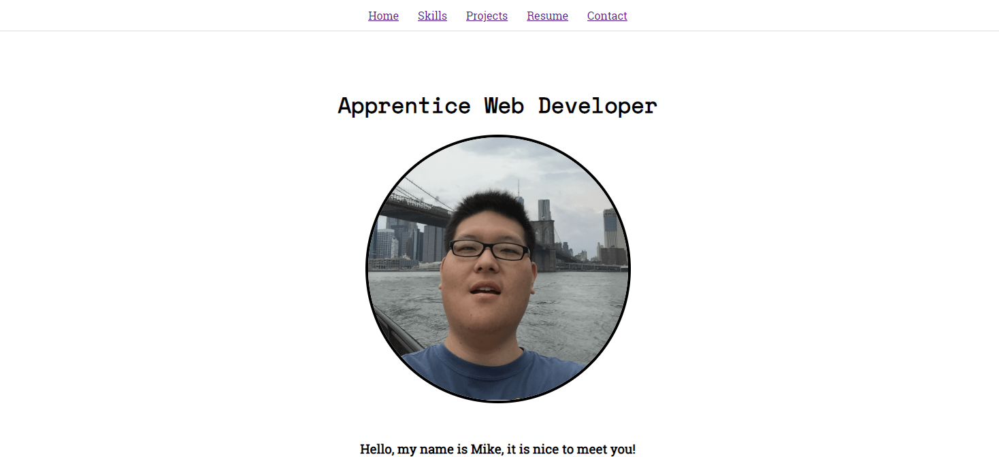
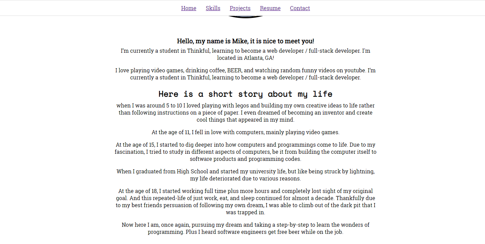
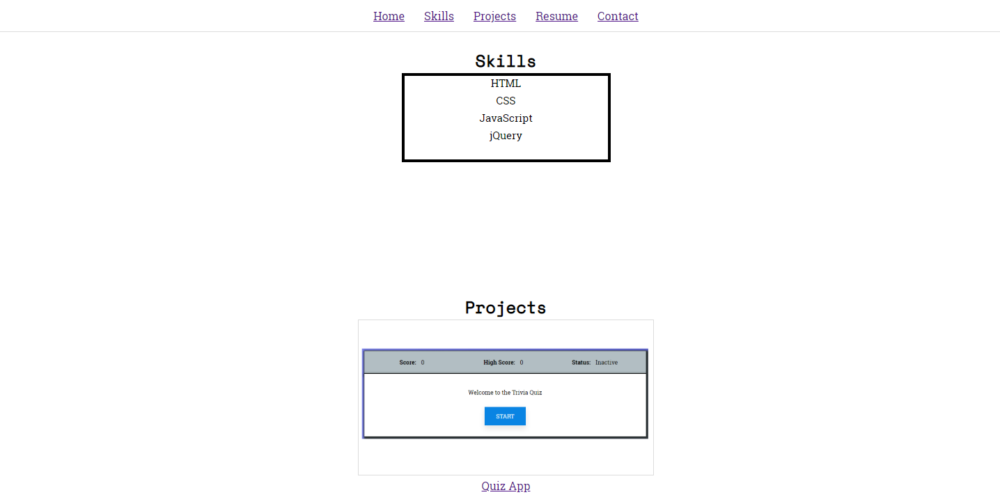
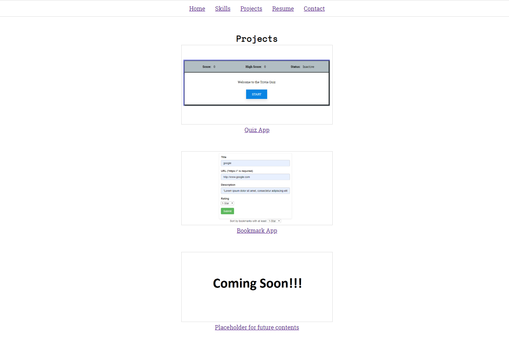
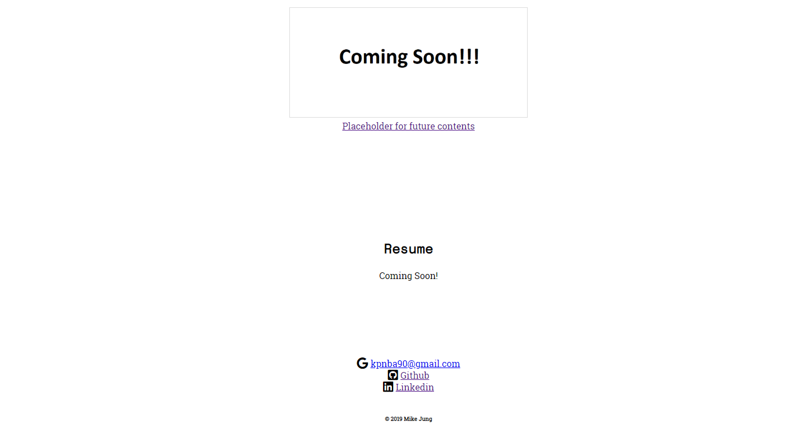

# Mike Jung Portfolio

## Table of Contents
- [Introduction](#introduction)
- [Goals](#goals)
- [Tech Stack](#tech-stack)
- [Components](#components)

## Introduction
This is the documentation for [Portfolio].

## Live Site
[Portfolio](https://mikejung90.github.io/Portfolio/ "Portfolio")

## Goals
### The goals for Portfolio is to:
1) Display my about me, skill set, projects, resume, and my contact informations
2) Allow user to navigate thru the web page with simply clicking on the links on navigation bar
3) Allow user to click on project link or image to go to live pages of said projects

## Tech Stack
* HTML
* CSS
* JavaScript
* jQuery

## Components
Component | Purpose |
--- | --- |
App | Porfolio |
About | Intro to my page and the landing page |
Navigation-Bar | Navigation bar that persists in all views |
Skills | Lists skill set I have accquired so far |
Projects | Display containing the Form component or existing appointment information |
Resume | Responsible for displaying a section of components |

## Screenshots
### Landing Page
First look of how the page is displayed

### About me
Scroll down to look for story about me

### Skills
Can be clicked on 'skills' on nav bar or scroll down to this section

### Prjects
Can be clicked on 'projects' on nav bar or scroll down to this section

### Resume/ Contacts
Can be clicked on 'resume' or 'contacts' on nav bar or scroll down to this section. Due to lack of contents both functions lead to similiar end point.
